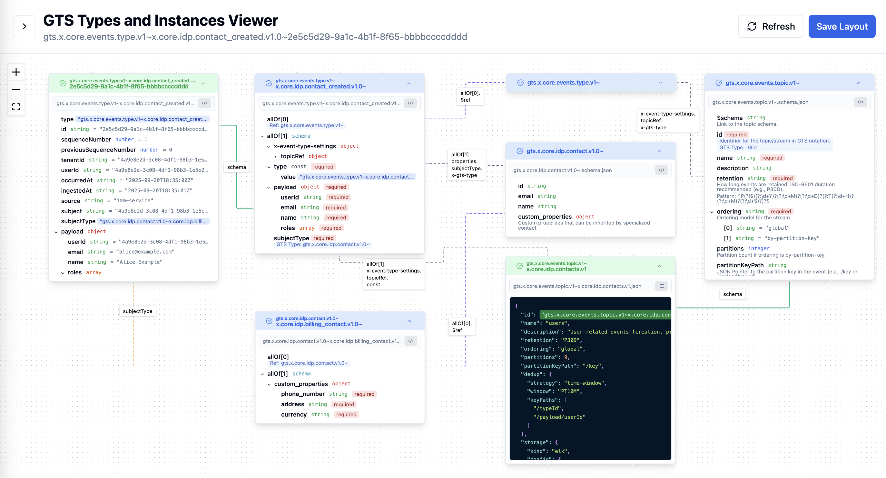

# GTS Viewer - Monorepo

A three-headed application for validating and viewing the [GTS](https://github.com/globaltypesystem/gts-spec) (**Generic Type System**) JSON schemas and instances with three deployment targets:

1. **Web App** (`apps/web`) plus **Server** (`apps/server`) - Browser-based viewer
2. **Electron App** (`apps/electron`) - Native desktop application
3. **VS Code Extension** (`apps/vscode-extension`) - Editor integration

This project is aimed at exploring and using GTS schemas and instances across platforms.



## Quick Start

### Prerequisites

- Node.js 18+ and npm
- For Electron: Platform-specific build tools
- For VS Code extension: VS Code 1.85+

### Installation

```bash
# Install all dependencies
npm install

# Build everything
npm run build
```

### Running

#### 1. Web App (Browser)

##### Development Mode

```bash
# Terminal 1: Start the server
npm run dev:server

# Terminal 2: Start the web app
npm run dev:web
```

Open http://localhost:7805

The server will be started on port `7806` and store GTS entities diagram layout in SQLite database in `{HOME}/.gts-viewer/server/viewer.db` directory. See the server configuration [README.md](apps/server/README.md) to override the default DB path, port or verbosity level.

##### Docker Compose (Production)

```bash
# Build and start both server and web app
docker-compose -f docker/docker-compose.yml up -d

# View logs
docker-compose -f docker/docker-compose.yml logs -f

# Stop services
docker-compose -f docker/docker-compose.yml down

# Or use Make commands
make docker-up
make docker-logs
make docker-down
```

The web app will be available at http://localhost:7805 and the server API at http://localhost:7806.

The server data (including SQLite database) is stored in `${HOME}/.gts-viewer/server/` on the host machine.

#### 2. Electron App (Desktop)

```bash
# Development mode (with hot reload)
npm run dev:electron

# Or build and run production
npm run build:electron
npm --workspace apps/electron run start
```

The Electron app will store the GTS diagram layout metadata in the individual files in `{HOME}/.gts-viewer/layouts/` directory.

#### 3. VS Code Extension

```bash
# Build the extension
npm run build:vscode

# Package as .vsix (for distribution)
npm run package:vscode

# Then in VS Code:
# 1. Open this folder in VS Code
# 2. Press F5 to launch Extension Development Host
# 3. Run command: "GTS: Open Viewer"

# Or install the packaged extension:
# code --install-extension apps/vscode-extension/gts-viewer-vscode-0.1.0.vsix
```

The VS Code plugin will store the GTS diagrams layout metadata in the `{REPOSITORY_ROOT}/.gts-viewer/` folder

#### 4. Cleanup

```bash
# Remove all generated files, including node_modules and package-lock.json
npm run clean
```

## Project Structure

```
gts/
├── apps/
│   ├── electron/            # Electron app
│   ├── server/              # Server app
│   ├── vscode-extension/    # VS Code extension
│   └── web/                 # Web app
├── examples/                # Sample JSON files and schemas with GTS entities
│   ├── events/
│   ├── roles/
│   └── settings/
├── packages/
│   ├── fs-adapters/         # Filesystem adapters for different deployment targets
│   ├── layout-storage/      # Layout storage abstraction
│   └── shared/              # Common TypeScript types
└── node_modules/
```

## Key Features

- Full support for JSONC (JSON with Comments)
- Automated GTS entities discovery in `*.json` or `*.gts` files
- JSON / JSON schema validation with respect of GTS ids for schemas
- JSONC support for comments and trailing commas
- Visual GTS entities layout editor and persistence
- Invalid file detection and error reporting

## Building

```
# Build everything
npm run build

# Or use Make (runs install + build)
make build

# Build individual targets
npm run build:web
npm run build:server
npm run build:electron
npm run build:vscode
```

## Docker Deployment

For detailed Docker documentation, see [docker/README.md](docker/README.md).

### Quick Start with Docker Compose

```bash
# Optional: Copy and customize environment variables
cp docker/.env.example docker/.env
# Edit docker/.env to change ports, verbosity, etc.
# By default web service will be running on localhost:8080

# Build and start services
docker-compose -f docker/docker-compose.yml up -d

# Or use Make commands (if available)
make docker-build
make docker-up

# Check status
docker-compose -f docker/docker-compose.yml ps
# or: make docker-status

# View logs
docker-compose -f docker/docker-compose.yml logs -f
# or: make docker-logs

# Stop services
docker-compose -f docker/docker-compose.yml down
# or: make docker-down
```

**Tip**: Run `make help` to see all available commands.

### Services

- **gts-server**: Backend API server (port 7806)
- **gts-web**: Frontend web application (port 7805)

### Data Persistence

The server stores data in `${HOME}/.gts-viewer/server/` which is mounted as a volume. This includes:
- `viewer.db` - SQLite database with layout snapshots
- `viewer.db-shm` and `viewer.db-wal` - SQLite write-ahead log files

### Building Individual Images

```bash
# Build server image
docker build -f docker/Dockerfile.server -t gts-server:latest .

# Build web image
docker build -f docker/Dockerfile.web -t gts-web:latest .
```

### Custom Configuration

You can customize the Docker Compose setup by editing `docker-compose.yml`:

```yaml
# Change ports
ports:
  - "9090:80"  # Web app on port 9090
  - "8080:7080"  # Server on port 8080

# Change data directory
volumes:
  - /custom/path:/data

# Change environment variables
environment:
  - GTS_SERVER_VERBOSITY=debug
```

### Rebuilding After Changes

```bash
# Rebuild and restart services
docker-compose -f docker/docker-compose.yml up -d --build

# Rebuild specific service
docker-compose -f docker/docker-compose.yml build gts-server
docker-compose -f docker/docker-compose.yml up -d gts-server

# Or use Make
make docker-rebuild
```

## Configuration

### Environment Variables

#### Server (`apps/server`)
- `GTS_SERVER_DB_FILE`: SQLite database path (default: `viewer.db`)
- `GTS_SERVER_PORT`: Server port (default: `7806`)
- `GTS_SERVER_HOME_FOLDER`: Home folder for server data (default: `~/.gts-viewer/server`)
- `GTS_SERVER_VERBOSITY`: Verbosity level: `silent`, `normal`, `debug` (default: `normal`)

See more in [apps/server/README.md](apps/server/README.md)

#### Web (`apps/web`)
- `GTS_SERVER_API_BASE`: API base URL (default: `http://localhost:7806`)

## Server API Documentation

When the server is running, visit:
- OpenAPI spec: http://localhost:7806/openapi.yaml
- API docs: http://localhost:7806/docs

### Key Endpoints

- `GET /layouts` - Get latest layout for a file
- `POST /layouts` - Save new layout version
- `GET /layouts/versions` - List all versions
- `GET /health` - Server health check
- `GET /settings` - Get global settings

## Troubleshooting

### Docker Issues

See [docker/README.md](docker/README.md) for comprehensive Docker troubleshooting.

### Server Port Already in Use (Development)
```bash
# Find and kill process on port 7806
lsof -ti:7806 | xargs kill -9
```

### VS Code Extension Not Loading
1. Check Output panel → "Extension Host"
2. Ensure `npm run build:vscode` completed successfully
3. Verify webview assets copied to `dist/webview/`
4. Ensure a workspace folder is open (required for layout storage)
5. Check that layout-storage package TypeScript files are compiled correctly

### Database Locked
- Close all running instances
- Delete the `.db-shm` and `.db-wal` files
- Restart

## Roadmap

Version 0.1.0:
- [x] Cross-platform targets: Web+Server, Electron, VS Code extension
- [x] JSONC support (comments, trailing commas)
- [x] Auto-discovery scan of `*.json`/`*.jsonc`/`*.gts` with progress and error reporting
- [x] Validation aware of GTS IDs; invalid file detection and reporting
- [x] Visual diagram editor (drag, expand/collapse, raw view)
- [x] Persistent layout storage (repo `.gts-viewer/` + server snapshots)
- [x] VS Code viewer: auto-rescan on save/change, initial selection
- [x] VS Code viewer: validation status sync, per-file layout refresh
- [x] Refresh resilience: restore selected entity and viewport after reload
- [x] Secure webview (CSP + nonce) and asset routing in extension

Version 0.2.0:
- [x] VS Code editor: inline diagnostics and quick fixes (code actions)
- [x] VS Code editor: jump to entity file / peek references
- [x] VS Code editor: ensure referred GTS ID exists in the project
- [x] VS Code editor: suggest GTS IDs in case of misprints

Version 0.2.1:
- [x] VS Code editor: nice visual styles for GTS parts
- [x] VS Code editor: open file in VS Code when clicked in the file name
- [x] Web viewer: improve the error reporting

Backlog:
- [ ] Diagram: multi-select, align/distribute, grouping and subgraphs
- [ ] Diagram: export PNG/SVG; import/export layout snapshots
- [ ] Performance: worker-based parsing, incremental graph build, virtualized lists
- [ ] Collaboration: layout versioning/history and remote sync
- [ ] Plugin API for custom relationships/edge styles
- [ ] UX: accessibility (ARIA/keyboard), theming, i18n
- [ ] Entity editor mode

## License

Apache License 2.0
